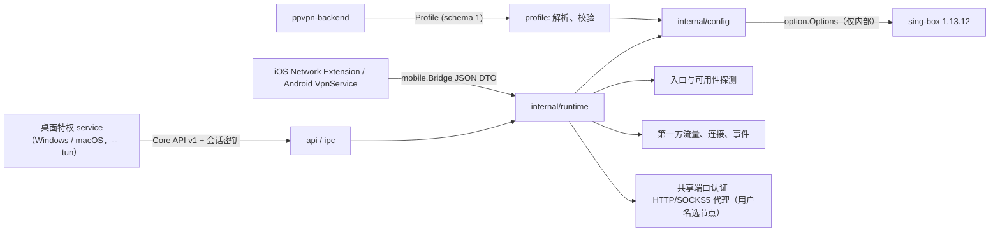
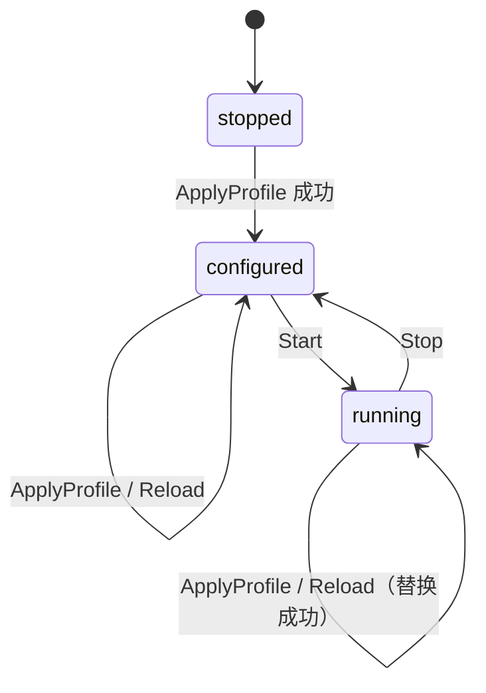

# 架构与生命周期

## 设计原则

核心的公开契约只有两层：后端到核心的 Profile Schema，以及桌面/移动宿主到核心的第一方控制接口。sing-box 是固定版本的内部执行引擎，不是产品协议。升级 sing-box 时不要求后端、桌面端或移动端同步理解其配置格式。

## 包边界

| 包 | 职责 | 是否公开稳定契约 |
| --- | --- | --- |
| `profile` | Profile DTO、严格解析、版本迁移、语义校验 | 是 |
| `api` | Core API v1 HTTP 契约、认证、统一错误封装 | 是 |
| `ipc` | Unix Domain Socket / Windows Named Pipe | 是 |
| `mobile` | gomobile 可绑定的 JSON DTO 桥 | 是 |
| `probe` | 入口 TCP 和端到端可用性探测 | 是 |
| `localproxy` | 设备本地共享代理端点、用户名与状态 | 是，但凭据只限受信宿主 |
| `internal/proxyinbound` | 共享代理 sing-box inbound（常量时间认证） | 否 |
| `internal/config` | Profile 到 sing-box `option.Options` 的直接构建 | 否 |
| `internal/runtime` | 引擎生命周期、热更新、遥测和事件 | 否 |
| `internal/redact` | 诊断输出脱敏 | 否 |

## 生命周期状态机

- 未应用 Profile 时，状态是 `stopped`；此时调用 `Start` 失败。
- `ApplyProfile` 会先复制、校验并构建候选配置。revision 与当前值相同则返回 `applied=false`，不触发重载。
- 运行中应用新 revision 时，核心启动替换实例。存在共享本地代理端口时会先停止旧实例以释放端口；若候选启动失败，则用旧构建结果恢复运行。
- `SelectNode` 原子更新 `selected` selector，不重建 runtime。已有 TCP/UDP flow 保持原节点，新 flow 使用新节点。
- `Reload` 重建当前 Profile，但对外保留原 revision。
- `Stop` 和重复 `Start`/`Stop` 是幂等的。

## Profile 与平台能力分离

Profile 描述“连接到哪些服务以及使用什么协议”；`PlatformCapabilities` 描述“本设备允许核心做什么”。TUN、本地监听地址、日志级别和平台名称只能由宿主提供，后端不得下发。

桌面 `serve` 默认启用每节点认证代理。每节点代理为每个稳定
node ID 提供一个同时支持 HTTP/SOCKS5 的认证端点。Windows 与 macOS 宿主都由特权 service 以
`--tun` 拉起 core、以 TUN 接管流量（macOS 不使用 Network Extension）；Profile 不包含系统级隧道配置。

## TUN 实际边界

`PlatformCapabilities.tun.enabled=true` 确实进入配置构建：macOS/Windows 会生成带 `auto_route`、`strict_route` 的 sing-box TUN inbound。桌面 CLI 提供 `--tun` 与 `--tun-stack`，但 core 不获取管理员/root 权限，不安装或打开平台驱动，不设置系统代理，也不承载平台 UI。因此普通权限 sidecar 不能被视为已经具备可交付 TUN。

Windows 与 macOS Desktop 都由特权 service 提供权限和平台资源，再以 `--tun` 启动 core
（Windows 为已签名 service；macOS 为 LaunchDaemon，core 打开 utun）；失败时保持未连接并通知用户，
不静默回退到系统代理。系统层面的 DNS 设置（macOS 用 `scutil` 覆盖，退出和异常后清理）归 service，
TUN 内部的 DNS 归 core。core 的 `PPVPNCore.xcframework` flow adapter（为 `NETransparentProxyProvider`
设计）目前没有宿主使用。iOS `NEPacketTunnelProvider` 与 Android `VpnService` 仍由宿主创建系统
VPN/TUN；移动 TUN 文件描述符桥接是后续接入点。

## 探测语义

- 入口探测逐个测量每个入口：`tcp` 方法直接 TCP 连接 `endpoint.ip:endpoint.port`（无 IP 时先解析 `endpoint.domain`，解析时间不计入），不做协议握手；`icmp` 方法发送一个 ICMP echo。结果字段是 `latency_ms`，节点级结果取 primary（`ingresses[0]`），primary 失败时取最快的成功 backup；每个入口结果带 `endpoint_key`/`replica_ordinal`/`role`。
- ICMP 始终不需要特权：macOS/iOS 与 Linux/Android 使用 `SOCK_DGRAM` ICMP socket（`golang.org/x/net/icmp` 的 `udp4`/`udp6`；Linux 需要 `net.ipv4.ping_group_range` 包含当前组，否则报告 `ICMP_UNSUPPORTED`），Windows 使用 IP Helper `IcmpSendEcho2`/`Icmp6SendEcho2`。
- 每个逻辑节点的入口渲染为独立 outbound；多入口节点由核心注册的 `ppvpn-failover` outbound 组合，primary（`ingresses[0]`）优先、按数组顺序拨号失败立即转 backup（只在同一 Node 内）、健康检查发现 primary 恢复后切回（见 [Backend Profile](backend-profile.md#故障转移语义)）。
- 可用性探测通过指定节点的认证本地 HTTP 代理发起完整 HTTP 请求；结果字段是 `total_ms`。它包含代理握手、节点连接和目标响应时间，不能当作入口延迟。
- 两类探测都有明确的超时、取消和稳定错误码，且会产生结构化事件。

## 遥测与事件

流量和活动连接由第一方路由跟踪器统计，不依赖 Clash API。公开连接只包含稳定 `node_id`，内部 outbound tag 不会序列化。事件是尽力投递：订阅者缓冲区满时丢弃新事件，调用方应在重连后用 `GetStatus` 重新同步当前状态，而不能把事件流当作持久化日志。
