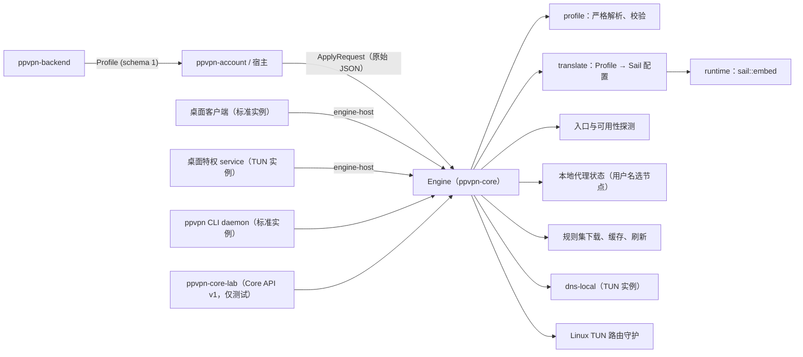
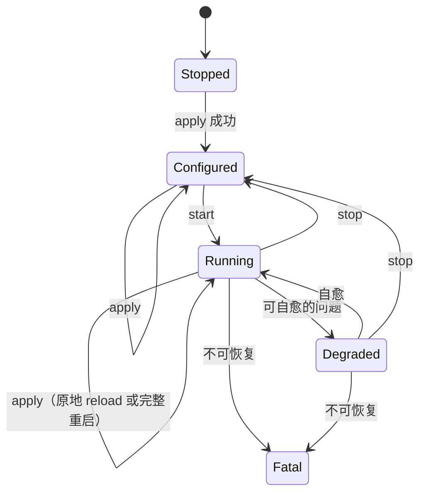

# 架构与生命周期

本文讲 Rust 引擎的结构。接口的签名和语义以 [宿主接入](host-integration.md) 为准，测试见 [测试分层](testing.md)。

## 设计原则

核心的公开契约只有两层：后端到核心的 Profile Schema，以及宿主到核心的 Rust API（`Engine` 和它的值类型）。引擎是 Rust 库 `ppvpn-core`，宿主从源码编译并链接它，在自己的进程里运行，没有 IPC，也没有会话密钥。

Sail 是钉在某个提交上的内部执行引擎，经 `sail::embed` 嵌入。Profile 翻译成 Sail 的 JSON 配置，这份配置只在引擎内部使用，不是产品协议。升级 Sail 时不要求后端、桌面端或 CLI 理解它的配置格式。

## 实例

一个 `Engine` 就是一个实例。桌面端运行两个：

| 实例 | 所在进程 | 权限 | 能力 |
| --- | --- | --- | --- |
| 标准实例（`Role::Standard`） | 桌面客户端，或 CLI 的 daemon | 普通用户 | 共享本地代理（优先 7890）、系统代理监听（7891，CLI 不开）、探测、流量与连接统计 |
| TUN 实例（`Role::Tun`） | 桌面特权 service | root / SYSTEM | TUN、Linux 上的路由规则守护、TUN 内的 DNS（劫持、解析、dns-local）、原地 reload |

一个进程里最多一个 TUN 实例（`TUN_INSTANCE_EXISTS`），标准实例不限数量。每个实例独占自己的 `state_dir`（`STATE_DIR_IN_USE`）。

桌面端的 `desktop/crates/engine-host` 把 Core API v1 的请求路径和 JSON 形状映射成 `Engine` 调用：客户端直接调用它驱动标准实例，service 用它应答客户端转发来的、发给 TUN 实例的请求。

## 模块边界

| 位置 | 职责 | 是否公开稳定契约 |
| --- | --- | --- |
| `crates/ppvpn-core` 根导出：`Engine`、`config`、`request`、`status`、`types`、`event`、`error` | 实例句柄和值类型：配置、apply 请求与结果、状态、事件、错误码 | 是（`#[non_exhaustive]`，只增不改） |
| `profile` | Profile DTO、严格解析、语义校验 | 否（Profile Schema 本身是契约，解析代码不是） |
| `translate` | Profile 到 Sail 配置的纯函数翻译，经 `translate::check` 做配置检查 | 否 |
| `runtime` | 引擎对 Sail 的全部需求，放在一个内部 trait 后面：`sail.rs` 接 `sail::embed`，`fake.rs` 给单元测试用 | 否 |
| `engine` | 生命周期、原地 reload、选择与 pin、网络变化、探测调度、日志、清理 | 否（`Engine` 的方法除外） |
| `localproxy` | 本地代理的 prefix、密码和端口，存在 `state_dir` | 否 |
| `rulesets` | 规则集下载、sha256 校验、缓存和后台刷新 | 否 |
| `localdns` | dns-local：读默认网卡的 DNS 服务器，在回环上应答 Sail | 否 |
| `tunrules`、`hostipv6` | Linux TUN 的策略路由守护；主机 IPv6 地址与出口探测 | 否 |
| `probe` | 入口探测（TCP、ICMP）与可用性探测 | 否 |
| `ppvpn_core::internal` | 只给本 crate 的测试和 `ppvpn-core-lab` 用 | 否，宿主不得使用 |

同一个 workspace 里的宿主和工具：

| crate | 作用 |
| --- | --- |
| `crates/ppvpn-cli` | `ppvpn` 命令行客户端，daemon 里运行一个标准实例，见 [CLI](cli.md) |
| `crates/ppvpn-account` | 登录和拉取 Profile |
| `crates/ppvpn-core-lab` | 测试宿主：以 `ppvpn-core serve` 的参数和日志格式、经 Unix socket 提供 lab 用到的 Core API v1，不是产品 |
| `desktop/crates/engine-host` | 桌面端的 Core API v1 到 `Engine` 的映射 |

## 生命周期状态机

- `new` 创建实例，状态是 `Stopped`。能在这一步确定的失败直接返回错误（权限、wintun.dll、`state_dir` 被占用、已有 TUN 实例），不进入 `Fatal`。`new` 还会先清扫上次被强杀留下的残留。
- `apply` 先校验原始 Profile，再按宿主传入的 `selected_node_id` 和 `pins` 选节点。`(revision, routing_mode, selected_node_id, pins)` 与当前生效的值相同时返回 `applied=false`，什么也不做。
- 规则集在 apply 前准备，最多等 10 秒；下载失败的规则集只让相关规则降级，不会让 apply 失败。
- 未运行时，apply 翻译出配置并交给 Sail 检查，留给 `start` 用。运行中的 apply 见下一节。任何一步失败，当前生效的配置都不变，并发出 `ReloadFailed`。
- `start` 需要已经 apply 过（否则 `PROFILE_NOT_APPLIED`），每次都重新翻译，因为 apply 之后选择和 pin 可能变了。
- `select_node` 只影响新连接，已有连接留在原节点；`pin_ingress` 立即生效。两者都由宿主持久化，下次 apply 时传回。
- 没有 `reload` 方法：规则集的刷新和恢复在引擎内部完成，并发出 `RuleSetChanged`。
- `stop` 回到 `Configured`，Profile 保留。重复的 `start`、`stop` 是幂等的。
- `Degraded` 时引擎在自愈，宿主只需提示原因；`Fatal` 时宿主丢弃并重建实例。
- `shutdown` 对整个实例生效，最多 10 秒，没清理完的项列在 `ShutdownReport.leftovers`。最后一个句柄被 drop 时，清理在实例自己的线程上进行，最多 5 秒。

## 运行中 apply

Sail 在同一个实例里原地 reload，没有第二个内核，也没有旧内核排空。

- **原地 reload（`KernelSwitch`）**：不关监听，已有连接留在原处继续运行。监听的变化也原地完成：新增的建起来，消失的移除，地址、端口或选项变了的就地替换；只有被移除或替换的监听断开它自己的连接。`ApplyResult.listeners` 列出这些变化。记一行 `kernel switched`，发 `KernelSwitched`。
- **完整重启（`FullRestart`）**：TUN 的变化，或者 Sail 表示必须重启（`needs_restart`、`inbound_lost`）时，停止再启动，所有连接断开，`reasons` 说明原因。重启期间状态保持 `Running`。新配置起不来时恢复原配置，apply 返回错误；原配置也起不来时实例停止（`CoreStopped`）。
- 同样的切换也用于规则集重建和主机 IPv6 出口变化后的重建。运行中开关系统代理监听、加回本地代理监听，走只涉及入站的 reload，出站、节点组、DNS、路由和规则集原样保留。

## Profile 与平台能力分离

Profile 描述"连接到哪些服务以及使用什么协议"；`EngineConfig` 描述"本设备上的这个实例做什么"：角色、平台、`state_dir`、本地代理的监听地址和首选端口、是否允许系统代理监听、TUN 的 dns-local 覆盖和 wintun.dll 路径、日志级别和输出。这些只能由宿主提供，后端不得下发。

## TUN 实际边界

TUN 实例由引擎让 Sail 创建 TUN 设备。在 Linux、macOS、Windows 上，TUN 入站带 `auto_route`、`strict_route`，并把 Profile 里所有入口的字面 IP 排除在隧道外，所以标准实例到入口的连接和探测不会进入隧道。网卡名在 Linux 上是 `ppvpn0`，Windows 上是 `PPVPN`，macOS 上由 Sail 选一个空闲的 `utunN`。

引擎不获取权限，不安装驱动，不设置系统代理，也不承载平台 UI。权限由宿主提供：桌面端由特权 service 运行 TUN 实例；Windows 的 wintun.dll 由宿主随安装包分发。系统层面的 DNS 设置（例如 macOS 上用 `scutil` 覆盖）归 service，TUN 内部的 DNS 归引擎。TUN 启动失败时，宿主保持未连接并通知用户，不静默回退到系统代理。

Linux 上，路由规则被删时由守护补回，补不回来进入 `Fatal{TunRoutingBroken}`。macOS 和 Windows 的路由完整性检查还没有，`status.tun_routing` 恒为 `ok`（`docs/rust-parity.md` N2）。

移动平台的情况见 [移动端接入](mobile.md)。

## 探测语义

- 入口探测直接测每个入口，不经隧道的规则：`tcp` 方法对 `endpoint.ip:endpoint.port` 做一次 TCP 握手（没有 IP 时先解析 `endpoint.domain`，解析时间不计入），不做协议握手；`icmp` 方法发一个 ICMP echo。结果字段是 `latency_ms`。节点级结果取 primary（`ingresses[0]`），primary 失败时取最快的成功 backup，都失败时报 primary 的失败。每个入口结果带 `endpoint_key`、`replica_ordinal`、`role`。入口探测需要已 apply 的 Profile，不需要已 start。
- ICMP 不需要特权：macOS/iOS 与 Linux/Android 用 `SOCK_DGRAM` ICMP socket（Linux 需要 `net.ipv4.ping_group_range` 包含当前组，否则报 `ICMP_UNSUPPORTED`），Windows 用 IP Helper 的 `IcmpSendEcho2`。
- 多入口节点翻译成一个 selector：默认成员是 Sail 的 fallback 组，primary 优先，按数组顺序拨号失败就换下一个入口（只在同一节点内），健康检查发现 primary 恢复后切回（见 [Backend Profile](backend-profile.md#故障转移语义)）；其余成员是各个入口，pin 就是让 selector 选中其中一个。
- 可用性探测经指定节点的出站发出一次完整的 GET（跟随重定向），结果字段是 `total_ms`，包含节点连接和目标响应的时间，不能当作入口延迟。它不经本地代理的监听，但实例必须带本地代理（否则 `LOCAL_PROXY_DISABLED`），并且已 start（否则 `CORE_NOT_RUNNING`）。TUN 实例始终返回 `LOCAL_PROXY_DISABLED`。
- 没有默认网卡时，两类探测都立即返回 `NO_DEFAULT_INTERFACE`，不拨号。两类探测都有超时和稳定的结果码，并发出 `EntranceProbed`、`AvailabilityProbed` 事件。

## 遥测与事件

流量和活动连接取自 Sail 的实例统计。引擎不定时轮询：宿主开始读取后每秒读一次 Sail，停止读取 10 秒后不再读，所以空闲后的第一次读取可能是旧值，`Traffic::measured_at` 标明读取时间。公开的连接只带稳定的 `node_id`，内部出站 tag 不出现在接口里。

网络变化只有一个来源：Sail 自己的网卡监视器。引擎据此发 `NetworkChanged`，进出 `Degraded{NoDefaultInterface}`，让 dns-local 跟随默认网卡，并在 TUN 实例上重新探测主机 IPv6 出口。

事件按种类订阅，每种一个有界缓冲。宿主处理慢时收到 `Lagged { kind, dropped }`，高频事件不会挤掉状态变化。事件不是持久化日志：重新订阅时先读 `status()` 快照，再接收事件。
